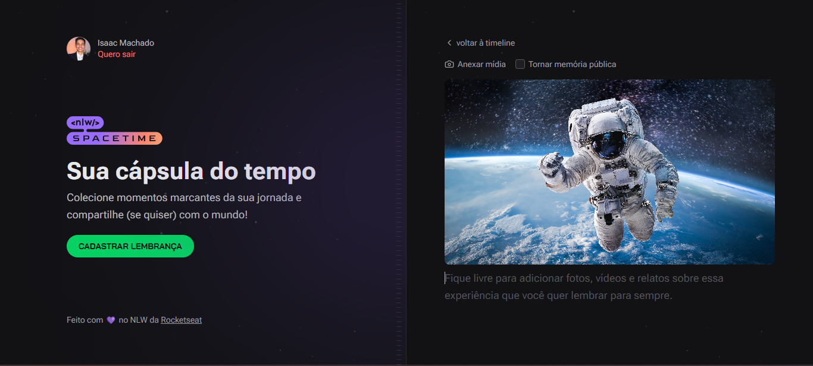

    

## 🖥️ Projeto
Esse é um projeto web Responsivo de uma cápsula do tempo para exibir memórias em um linha do tempo.

## 🚀 Tecnologias
Esse prjeto foi desenvolvido durante o NLW da RocketSeat com as seguintes tecnologias:

- React
- NodeJS
- HTML e CSS
- GIT
